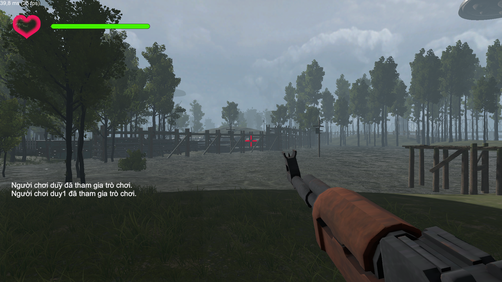

Để trải nghiệm game có thể vào thử mục Build_game rồi tải file Game_shooter_3D_unity_multiplayer.exe về Window để chơi thử (Dùng thử map mới file Map_NEW.exe https://drive.google.com/file/d/1tOAoDtTtZ_EqwVv9b3CdBvmT_Kk3RSft/view?usp=sharing)

Game hiện tại chơi được trên 2 nền tảng là Window và Linux sau đây là một số lưu ý.
Phím W: tiến.
Phím S: lùi.
Phím A: rẽ trái.
Phím D: rẽ phải.
Phím Escape: Thoát game.
Phím Space: nhảy.
Phím LeftShift: di chuyển nhanh(tăng tốc).
MouseLeft: Bắn.

Luật chơi: Người chơi được đưa vào một bối cảnh game được thiết kế sẵn. Trong đó tất cả các người chơi sẽ phải hạ gục đối thủ (Người chơi khác 1 vs nhiều người chơi). Người chơi bị hạ gục sẽ được hồi sinh sau 5s và ở 1 vị trí bất kỳ trên bản đồ. Trò chơi chỉ kết thúc khi TẤT CẢ CÁC NGƯỜI CHƠI THOÁT RA KHỎI PHÒNG.  

Map sau khi làm mới: Bản thử nghiệm 23/06/2023

Kết quả chơi thử nghiệm

Kết quả build game trên nền tảng linux

Kết quả build game trên nền tảng thiết bị di động

