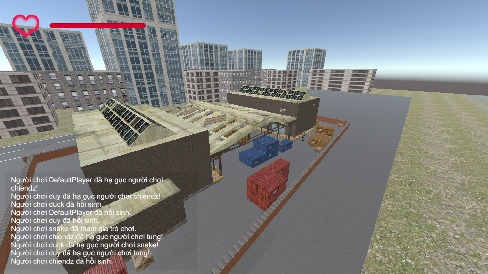
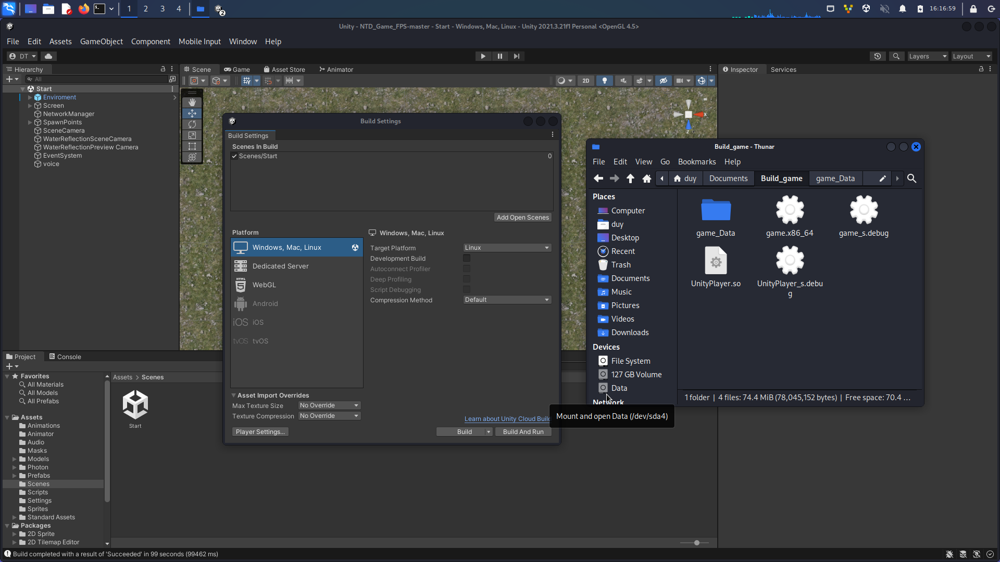
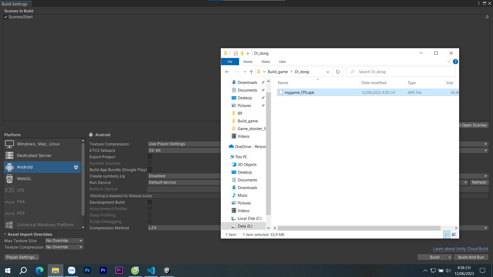
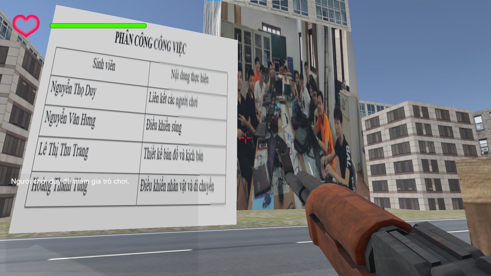

Game hiện tại chơi được trên 2 nền tảng là Window và Linux sau đây là một số lưu ý.
Phím W: tiến.
Phím S: lùi.
Phím A: rẽ trái.
Phím D: rẽ phải.
Phím Escape: Thoát game.
Phím Space: nhảy.
Phím LeftShift: di chuyển nhanh(tăng tốc).
MouseLeft: Bắn.

Luật chơi: Người chơi được đưa vào một bối cảnh game được thiết kế sẵn. Trong đó tất cả các người chơi sẽ phải hạ gục đối thủ (Người chơi khác 1 vs nhiều người chơi). Người chơi bị hạ gục sẽ được hồi sinh sau 5s và ở 1 vị trí bất kỳ trên bản đồ. Trò chơi chỉ kết thúc khi TẤT CẢ CÁC NGƯỜI CHƠI THOÁT RA KHỎI PHÒNG.  

Bảng phân chia công việc

Kết quả chơi thử nghiệm

Kết quả build game trên nền tảng linux

Kết quả build game trên nền tảng thiết bị di động

1 Cảnh nổi bật trong game
